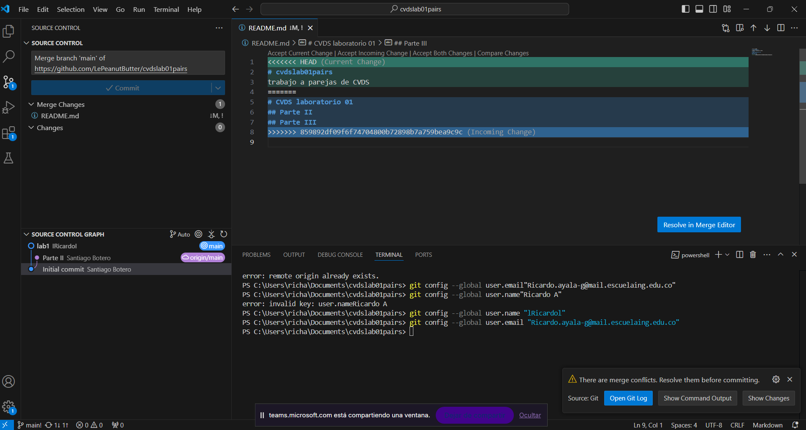
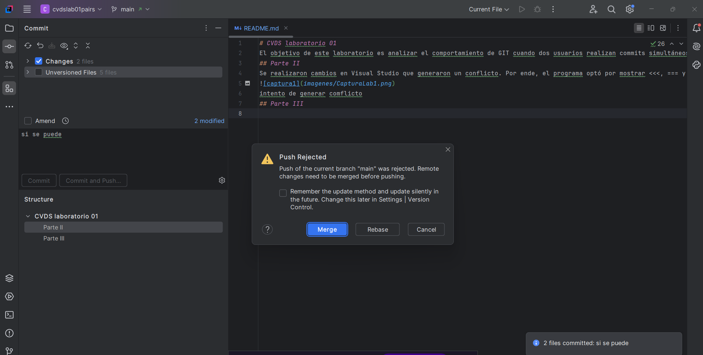
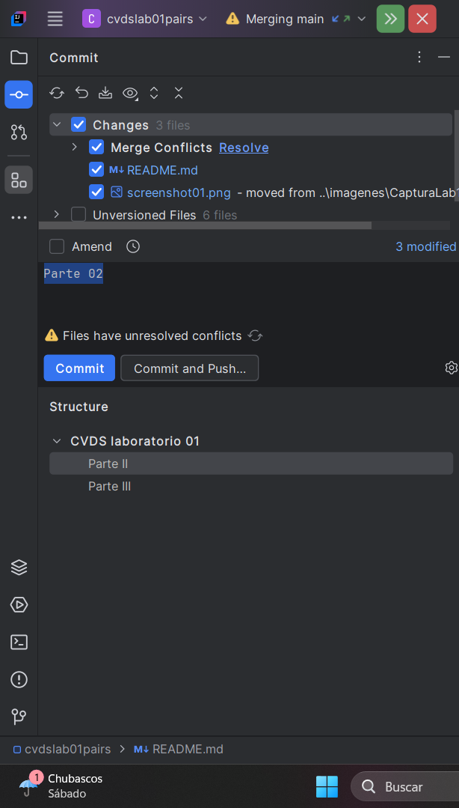
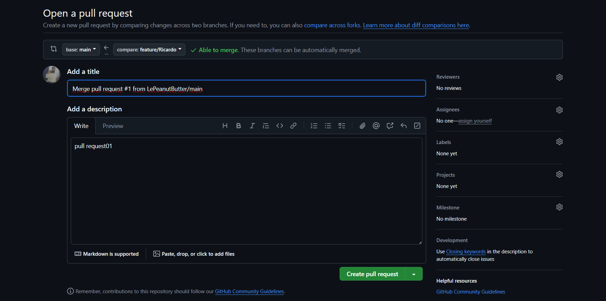
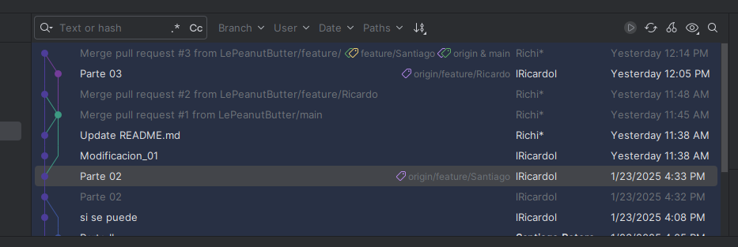

# CVDS laboratorio 01
El objetivo de este laboratorio es analizar el comportamiento de GIT cuando dos usuarios realizan commits simultáneos en
el mismo archivo.

## Parte II
Se hicieron cambios en Visual Studio que causaron un conflicto, porque la última persona en hacer modificaciones no había
hecho un pull de los cambios más recientes. Como resultado, el programa mostró los símbolos <<<, === y >>> para señalar posibles
conflictos y permitir que se resuelvan manualmente. Para solucionar estos problemas, se puede usar la opción de merge:

Adicionalmente, se optó por utilizar IntelliJ IDEA para verificar la solución de errores con el propósito de identificar
posibles conflictos:

Ahora que se ha realizado la refactorización con los últimos cambios, se puede hacer un merge y crear un pull request
hacia la rama principal para incorporar los nuevos cambios:

## Parte III
1) ¿Hay una mejor forma de trabajar con git para no tener conflictos?
La mejor manera de evitar conflictos en Git es mantener las ramas actualizadas con los últimos cambios de la rama principal
(usando git fetch y luego git merge o git rebase). Es importante trabajar en ramas separadas para cada funcionalidad,
gestionando las pull requests adecuadamente. De esta forma, se minimiza el riesgo de dañar la rama principal. Además, una
comunicación constante con el equipo es clave para asegurar una distribución eficiente de tareas.

2) ¿Qué es y como funciona el Pull Request?
Un pull request es una solicitud que hace alguien que ha copiado un repositorio al dueño del repositorio original,
pidiendo que se añadan los cambios que hizo en su copia al repositorio principal. En lugar de trabajar directamente en
el repositorio original, la persona hace los cambios en su propia rama y luego propone esos cambios mediante un pull
request. Este proceso permite que el dueño del repositorio original revise los cambios antes de incorporarlos,
ayudando a evitar problemas y a asegurar que todo esté bien integrado.

Imagenes relacionadas:

## Integrantes
- Santiago Botero Garcia - [LePeanutButter](https://github.com/LePeanutButter)
- Ricardo Andres Ayala Garzon - [lRicardol](https://github.com/lRicardol)